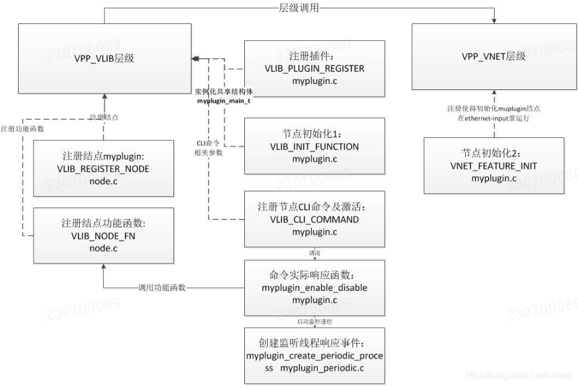

## 1. 创建插件模版及编译

```sh
# 创建模版
sudo apt install emacs					# 安装emacs
cd vpp/src/plugins/
../../extras/emacs/make-plugin.sh		# 执行创建插件脚本
    Plugin name: myplugin
    Dispatch type [dual or qs]: dual

# 编译
cd ~/vpp
make help
make wipe
make build
make run

# 拷贝库
sudo cp -f ./build-root/build-vpp_debug-native/vpp/lib/x86_64-linux-gnu/vpp_plugins/my_test_plugin_plugin.so /lib/x86_64-linux-gnu/vpp_plugins
systemctl restart vpp
```
## 2. 文件介绍

```sh
CMakeLists.txt       # 插件编译配置文件，包含编译插件名称、编译代码、依赖库、api文件设置等；
myplugin.c           # 结点初始化VNET_FEATURE_INIT，注册消息队列到全局；注册CLI命令及其响应函数，同时启动定时扫描进程,见periodic文件；
myplugin_periodic.c  # 定义了扫描进程函数，相关事件触发机制，监听插件是否工作；
myplugin_test.c      # 定义api方式定义的客户端vat方面代码；
node.c               # 完成结点注册VLIB_REGISTER_NODE以及插件功能实现函数VLIB_NODE_FN；
myplugin.api         # 主要是同vat客户端程序通信数据格式的接口定义,便于结构同步；可参考文章
myplugin_test.c      # vat客户端测试代码
```

## 3. 源码分析

    生成模板插件中的部分文件引用了VPP库中几个关键性目录中文件，可以参考如下目录；要注意的是，整个VPP的软件框架主要分为四个层面，依次执行顺序是VPP Infra->VLIB->VNET->Plugins，所以程序编码中，会以VLIB宏为基础执行，然后是VNET相关宏。
```sh
top     ├──Plugins     包含越来越丰富的数据平面插件集,可以认为每一个插件是一个小型的应用app
│       │
│       ├──VNET        与VPP的网络接口（第2,3和4层）协同工作，执行会话和流量管理，并与设备和数据控制平面配合使用
│       │
│       ├──VLIB        矢量处理库。vlib层还处理各种应用程序管理功能：缓冲区，内存和图形结点管理，维护和导出计数器，线程管理，数据包跟踪。Vlib实现调试CLI（命令行界面）
│       │
bottom  └──VPP Infra   VPP基础设施层，包含核心库源代码。该层执行内存函数，与向量和环一起使用，在哈希表中执行键查找，并与定时器一起用于调度图结点
```

    注册了process结点，监听插件是否工作的事件MYPLUGIN_EVENT_PERIODIC_ENABLE_DISABLE，通过命令行来触发VLIB_CLI_COMMAND (myplugin_enable_disable_command, static)这个事件。使用这里enable了，该插件才会work。
    注册了内部结点，让其在ethernet-input结点运行之前运行。

### 3.1 注册结点：VLIB_REGISTER_NODE

    在node.c的VLIB_REGISTER_NODE中注册了内部结点myplugin。

```C
vlib_node_registration_t myplugin_node; //插件注册结点结构体
 
VLIB_REGISTER_NODE (myplugin_node) =
{
  .name = "myplugin",                 //结点名称
  .vector_size = sizeof (u32),
  .format_trace = format_myplugin_trace,
  .type = VLIB_NODE_TYPE_INTERNAL,      //内部结点类型
  .n_errors = ARRAY_LEN(myplugin_error_strings),
  .error_strings = myplugin_error_strings,
  .n_next_nodes = MYPLUGIN_N_NEXT,
  .next_nodes = {
        [MYPLUGIN_NEXT_INTERFACE_OUTPUT] = "interface-output",
  },
};
```

### 3.2 结点功能实现函数：VLIB_NODE_FN

    在node.c文件中，定义结点myplugin_node的实现函数VLIB_NODE_FN (myplugin_node)，主要实现功能是对input结点收进来的报文，做一个src dst mac交换，然后源端口发送出去。因其参数为myplugin_node，所以与注册结点置入同一文件中。
    该结点功能函数调用是在myplugin.c文件中的vnet_feature_enable_disable 函数中。
    那么为什么在VLIB_NODE_FN中定义功能函数，vnet_feature_enable_disable中实现功能函数，它们是如何关联上的呢？答案在节3.4的VNET_FEATURE_INIT (myplugin, static) 函数中。

```C
VLIB_NODE_FN (myplugin_node) (vlib_main_t * vm,
          vlib_node_runtime_t * node,
          vlib_frame_t * frame)
{
...
//交换mac的功能实现，这里不展开
}
```

### 3.3 注册插件名称以及描述:VLIB_PLUGIN_REGISTER

    在myplugin.c的VLIB_PLUGIN_REGISTER中，描述了插件的VPP版本号以及描述等信息。
```C
VLIB_PLUGIN_REGISTER () =
{
  .version = VPP_BUILD_VER,
  .description = "myplugin plugin description goes here",
};
 
//其实VLIB_PLUGIN_REGISTER为结构体，在vlib/unix/plugin.h中定义
typedef CLIB_PACKED(struct {
  u8 default_disabled;
  const char version[32];
  const char version_required[32];
  const char *early_init;
  const char *description;
}) vlib_plugin_registration_t;
```

### 3.4 注册结点初始化1：VLIB_INIT_FUNCTION

    在myplugin.c的VLIB_INIT_FUNCTION函数中，实例化myplugin_main_t结构体，赋值各个参数，其中msg_id_base是重点，将本API消息注册到全局hash表中。

```C
//这里是myplugin_main_t结构体定义
typedef struct {
    /* API message ID base */
    u16 msg_id_base;
    /* on/off switch for the periodic function */
    u8 periodic_timer_enabled;
    /* Node index, non-zero if the periodic process has been created */
    u32 periodic_node_index;
    vlib_main_t * vlib_main;
    vnet_main_t * vnet_main;
    ethernet_main_t * ethernet_main;
} myplugin_main_t;
 
//这里定义VLIB初始化函数并绑定到VLIB库上
VLIB_INIT_FUNCTION (myplugin_init);
 
static clib_error_t * myplugin_init (vlib_main_t * vm)
{
  myplugin_main_t * mmp = &myplugin_main;
  clib_error_t * error = 0;
  mmp->vlib_main = vm;
  mmp->vnet_main = vnet_get_main();
  /* Add our API messages to the global name_crc hash table */
  mmp->msg_id_base = setup_message_id_table ();
  return error;
}
```

### 3.4 注册结点初始化2：VNET_FEATURE_INIT

    因此VLIB与VNET是层级调用关系，所以在myplugin.c的VNET_FEATURE_INIT初始化，让其在ethernet-input结点运行之前运行。此处第一参数myplugin结构体的定义在vnet/feature/feature.h中。
    这一步中，将VLIB中定义的myplugin功能函数通过.node_name以及.arc_name联系起来，因此调用3.2节的结点功能函数时，使用vnet_feature_enable_disable ("device-input", "myplugin",sw_if_index, enable_disable, 0, 0);，函数参数是个重点。

```C
/* *这里面对结点myplugin的初始化，让其* */
VNET_FEATURE_INIT (myplugin, static) =
{
  .arc_name = "device-input",
  .node_name = "myplugin",
  .runs_before = VNET_FEATURES ("ethernet-input"),
};
/* *INDENT-ON */
```

### 3.5 注册结点的CLI命令及激活：VLIB_CLI_COMMAND

    通过命令行来触发VLIB_CLI_COMMAND (myplugin_enable_disable_command, static)事件，CLI命令是myplugin enable-disable eth0，挂载成功后该插件才会work。关闭某端口的该功能myplugin enable-disable eth0 disable。

```C
//这里是注册CLI响应函数的接口，.funtion指向了实现函数。
VLIB_CLI_COMMAND (myplugin_enable_disable_command, static) =
{
  .path = "myplugin enable-disable",
  .short_help =
  "myplugin enable-disable <interface-name> [disable]",
  .function = myplugin_enable_disable_command_fn,
};
 
//该函数嵌套一层操作返回判断，最后执行了myplugin_enable_disable函数
static clib_error_t *
myplugin_enable_disable_command_fn (...)
{  ...
  rv = myplugin_enable_disable (mmp, sw_if_index, enable_disable);
  switch(rv){...}
  return 0;
}
 
//真正响应CLI命令的函数
int myplugin_enable_disable (myplugin_main_t * mmp, u32 sw_if_index,int enable_disable)
{
    ...
    //创建监控进程
  myplugin_create_periodic_process (mmp);
  //执行结点功能函数
  vnet_feature_enable_disable ("device-input", "myplugin",
                               sw_if_index, enable_disable, 0, 0);
  //给监控程序发送开关插件事件
  vlib_process_signal_event (mmp->vlib_main,
                             mmp->periodic_node_index, MYPLUGIN_EVENT_PERIODIC_ENABLE_DISABLE,
                            (uword)enable_disable);
  return rv;
}
```

### 3.6 创建监听线程响应事件

    在执行上述CLI命令中，真实实现函数myplugin_enable_disable里面创建了监控进程，查看插件是否工作，并响应事件。真实的实现函数在文件myplugin_periodic.c中。之后具体事件处理不详细罗列。

```C
//创建监听进程，用于响应所有开启myplugin功能的接口的事件。
void myplugin_create_periodic_process (myplugin_main_t *mmp)
{
  /* Already created the process node? */
  if (mmp->periodic_node_index > 0)
    return;
  /* No, create it now and make a note of the node index */
  mmp->periodic_node_index = vlib_process_create (mmp->vlib_main,
    "myplugin-periodic-process",
    myplugin_periodic_process, 16 /* log2_n_stack_bytes */);
}
```

### 3.7 完成测试VAT客户端消息响应函数

    myplugin.c文件中具有API消息处理函数，应该是结合测试程序VAT使用的。
    该函数主要作为VPP服务端用于开启关闭插件功能，VAT客户端实现见myplugin_test.c文件，同时它们之间交互接口的定义见C语言的myplugin.api。

```C
/* API消息处理函数 */
static void vl_api_myplugin_enable_disable_t_handler
(vl_api_myplugin_enable_disable_t * mp)
{
  ...
  rv = myplugin_enable_disable (mmp, ntohl(mp->sw_if_index),(int) (mp->enable_disable));
  ...
}
```

## 4. 流程图归纳

